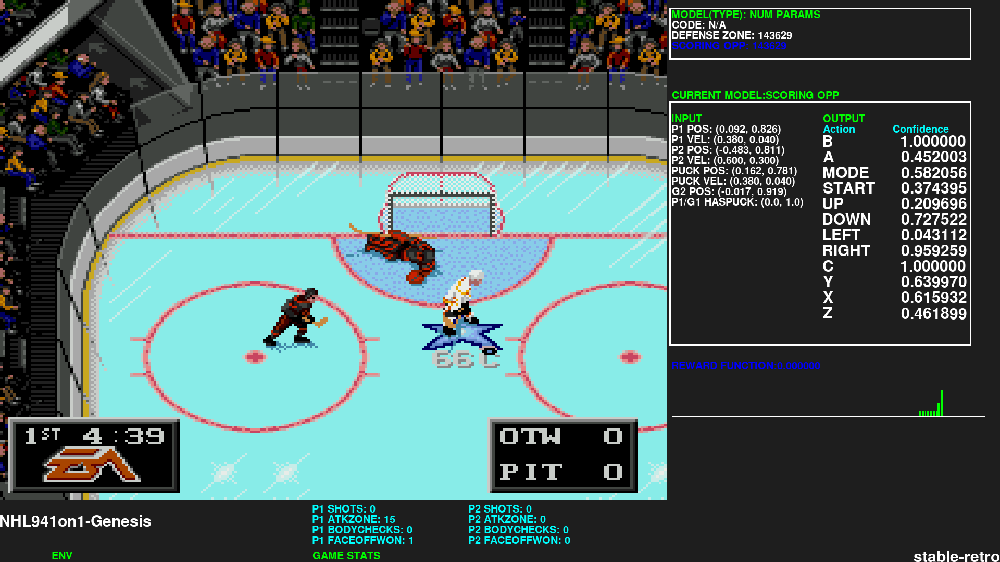
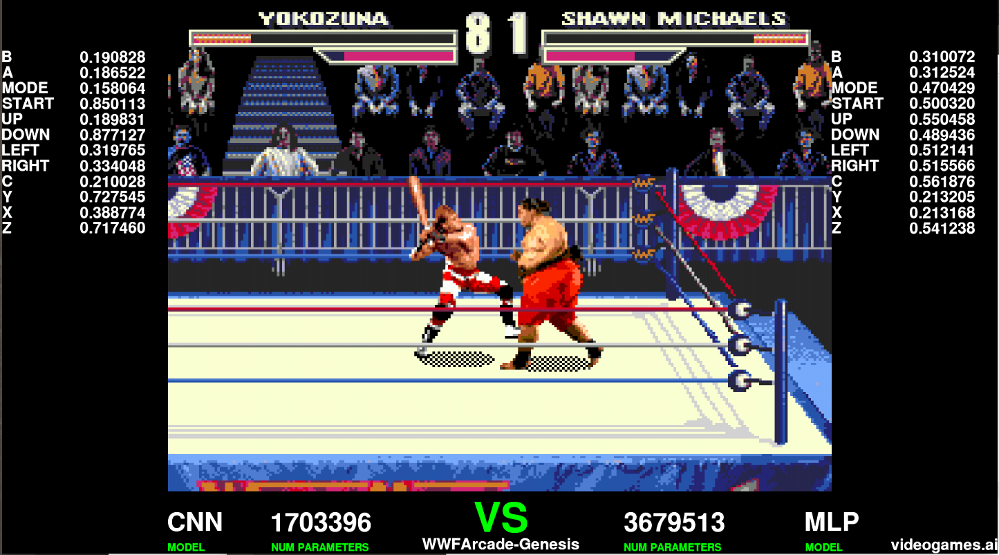

# stable-retro scripts

Note: Migrated to pytorch and stable-baselines3. The old tensorflow + original stable-baselines is now in TF1 branch.

* Train models on retro games
* Pit two models against each other on PvP retro games such as NHL94, Mortal Kombat or WWF Wrestlemania: The Arcade Game
* Play against an improved AI opponent





## Installation

Tested on Ubuntu 22.04 and Windows 11 WSL2 (Ubuntu 22.04 VM)

Requires:
*   Python 3.7 and up
*   stable-baselines3 with gymnasium support
*   stable-retro with gymnasium support (fork of gym-retro)

```
sudo apt update
sudo apt-get install python3 python3-pip git zlib1g-dev libopenmpi-dev ffmpeg cmake

pip3 install git+https://github.com/Farama-Foundation/stable-retro.git
pip3 install "stable_baselines3[extra]" pygame torchsummary

git clone https://github.com/MatPoliquin/stable-retro-scripts.git
cd stable-retro-scripts
```

## Install roms
You need to provide your own roms

In your rom directory exec this command, it will import the roms into stable-retro
```
python3 -m retro.import .
```

Currently there is two NHL 94 env in stable-retro: The original game and the '1 on 1' rom hack which as the name implies is for 1 on 1 matches instead of full teams

## Examples

Train Yokozuna Model:
```
python3 model_trainer.py --env=WWFArcade-Genesis --state=VeryHard_YokozunaVsShawnMicheals --num_timesteps=5000000 --play
```

Train Shawn Micheals Model:
```
python3 model_trainer.py --env=WWFArcade-Genesis --state=VeryHard_ShawnMichealsVsYokozuna --num_timesteps=5000000 --play
```

The models (zip files) should reside in the output directory (by default in the /home directory)


### Pit your two models against each other
```
python3 model_vs_model.py --env=WWFArcade-Genesis --load_p1_model=~/yokozuna.zip --load_p2_model=~/shawn_micheals.zip
```

### Game specific training script to beat WWF (Continental mode)
```
python3 wwf_trainer.py --play
```


### Play pre-trained model
```
python3 model_vs_game.py --env=WWFArcade-Genesis --state=VeryHard_YokozunaVsShawnMicheals --load_p1_model=~/yokozuna.zip
```


## Devlog

For NHL94:
https://youtube.com/playlist?list=PLmwlWbdWpZVtH6NXqWbrnWOf6SWv9nJBY

NHL94 Discord (with a subgroup dedicated for AI):
https://discord.gg/SDnKEXujDs
