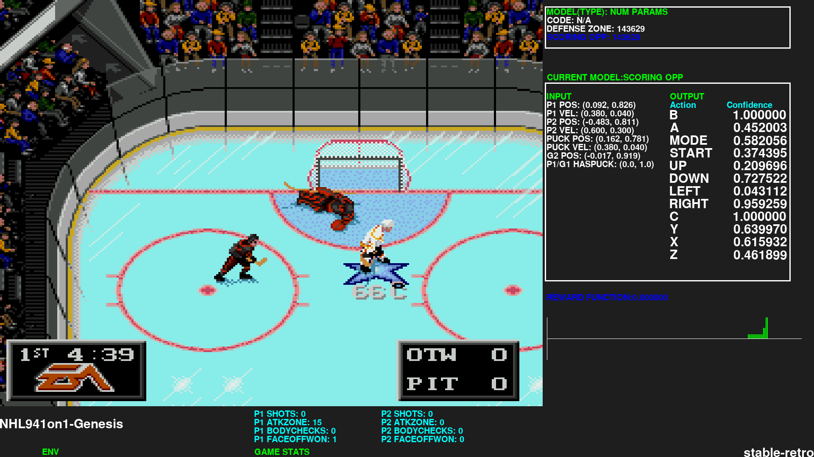
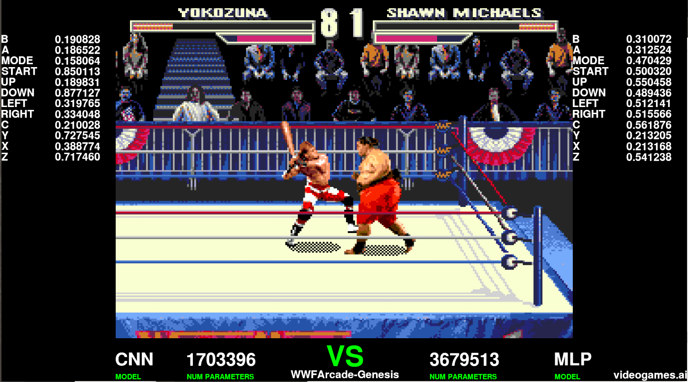
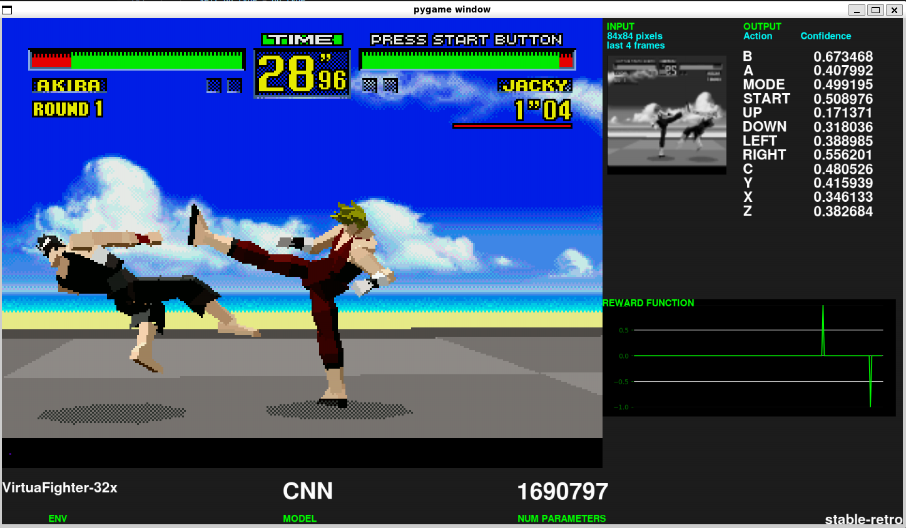

# stable-retro scripts

* Train models on retro games
* Pit two models against each other on PvP retro games such as NHL94, Mortal Kombat or WWF Wrestlemania: The Arcade Game
* Play against an improved AI opponent
* Export models for use in emulator frontends through [retro-ai-runtime](https://github.com/MatPoliquin/retro-ai-runtime)

### Supported models
*   MLPs
*   Nature CNN (from DeepMind)
*   Impala CNN (from DeepMind)
*   Combined Input models (image + scalar)

Experimental:
*   Attention MLPs

NHL94 (1 on 1)           |  Wrestlemania: The Arcade game |  Virtua Fighter 1
:-------------------------:|:-------------------------:|:-------------------------:
  |   | 


## Installation

Tested on Ubuntu 22.04/24.04 and Windows 11 WSL2 (Ubuntu 22.04 VM)

Requires:
*   Python 3.10 through 3.12
*   gymnasium
*   stable-baselines3
*   stable-retro (fork of gym-retro)

```bash
sudo apt update
sudo apt-get install python3 python3-pip python3-venv git zlib1g-dev libopenmpi-dev ffmpeg cmake libgl1-mesa-dev

python3 -m venv .venv
source .venv/bin/activate

python3 -m pip install --upgrade pip
python3 -m pip install -r requirements.txt
```

The manifest records minimum known-working versions and allows pip to select
current compatible releases. To install lint tooling as well:

```bash
python3 -m pip install -r requirements-dev.txt
```

If you need an editable `stable-retro` checkout for emulator development, clone
the pinned release beside this repository and replace the installed wheel:

```bash
git clone --branch v1.0.1 --depth 1 https://github.com/Farama-Foundation/stable-retro.git ../stable-retro
python3 -m pip install --no-deps -e ../stable-retro
```

Windows WSL2 + Ubuntu 22.04 setup guide: https://www.youtube.com/watch?v=vPnJiUR21Og

## Install roms
You need to provide your own roms

In your rom directory exec this command, it will import the roms into stable-retro
```
python3 -m retro.import .
```

All command examples below assume you run them from the repository root.

### Train a model
Note: Airstriker is a public domain rom and is already included in stable-retro
```bash
python3 scripts/train.py --env=Airstriker-Genesis --nn=CnnPolicy --num_env=8 --num_timesteps=1_000_000 --play --hyperparams=../hyperparams/default.json
```

### Run a curriculum
```bash
python3 scripts/train_curriculum.py --curriculum curriculum/nhl94.json
```

## Game specific Examples

*   For NHL94 specific page click [here](./readmes/NHL94-README.md)
*   For Wrestlemania the arcade game specific page click [here](./readmes/WWF-README.md)

## Emulator runtime

The C++ inference library has moved to
[retro-ai-runtime](https://github.com/MatPoliquin/retro-ai-runtime). It runs exported
models inside emulator frontends such as RetroArch to control player input.

Training, evaluation, and [model export](./scripts/export_model.py) remain here.
See the runtime repository for its source code, build instructions, and C++ tests.
RetroArch-side integration remains in
[RetroArchAI](https://github.com/MatPoliquin/RetroArchAI).

Tutorial video:
[](https://www.youtube.com/watch?v=hkOcxJvJVjk)
